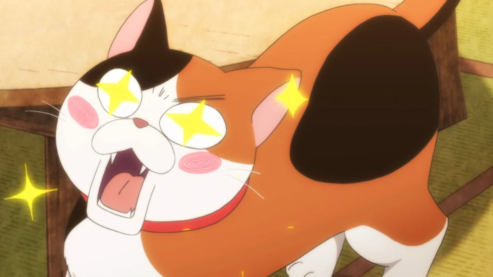

[](https://github.com/gongahkia/mike/releases/tag/1.0.0) 

# `Mike`

Rudimentary, [USI](http://hgm.nubati.net/usi.html)-compliant [Shogi Engine](https://en.wikipedia.org/wiki/Computer_shogi) that follows these [learned heuristics](#logic).

## Stack

* *Frontend*: [HTML](https://developer.mozilla.org/en-US/docs/Web/HTML), [CSS](https://developer.mozilla.org/en-US/docs/Web/CSS), [JavaScript](https://developer.mozilla.org/en-US/docs/Web/JavaScript)
* *Backend*: [Python](https://www.python.org/), [Flask](https://flask.palletsprojects.com/en/stable/)
* *Cache*: [Redis](https://redis.io/)

## Screenshots

### Difficulty selection


### User move


### Shogi AI move


### User move suggestion 


### User position analysis


## Usage

The below instructions are for locally hosting `Mike`.

1. Execute the below.

```console
$ git clone https://github.com/gongahkia/mike && cd mike
$ chmod +x start.sh
```

2. Then run the below shell script to spin up both the Frontend and Backend.

```console
$ ./start.sh
```

## Architecture

```mermaid
graph TB
    subgraph "Mike Shogi Engine Architecture"
        subgraph "Frontend Layer" 
            UI[🎌 Web Interface<br/>HTML5 + Vanilla JS]
            Board[🏁 Interactive Board<br/>Drag & Drop UI]
            Controls[🎮 Game Controls<br/>New Game, AI Move, Analysis]
        end

        subgraph "API Gateway"
            Flask[🌐 Flask REST API<br/>CORS Enabled]
            Routes[📡 API Routes<br/>Game Management]
        end

        subgraph "Game Engine Core"
            GameMgr[🎯 Game Manager<br/>Session Handling]
            BoardState[📋 Board State<br/>Position Management]
            MoveVal[✅ Move Validator<br/>Legal Move Generation]
        end

        subgraph "Piece System"
            PieceTypes[♛ Piece Definitions<br/>King, Rook, Bishop, etc.]
            Movement[🔄 Movement Logic<br/>Pattern Generation]
            Promotion[⬆️ Promotion System<br/>Piece Enhancement]
        end

        subgraph "AI Engine - Mike Brain"
            AIController[🧠 AI Controller<br/>Difficulty Management]
            
            subgraph "Search Engine"
                Minimax[🔍 Minimax Algorithm<br/>Alpha-Beta Pruning]
                Depth[📊 Variable Depth<br/>1-5 Plies]
                TimeCtrl[⏱️ Time Control<br/>Emergency Management]
            end
            
            subgraph "Evaluation System"
                Material[💎 Material Balance<br/>Piece Values]
                Position[📍 Positional Score<br/>Square Control]
                KingSafety[👑 King Safety<br/>Attack Patterns]
                Mobility[🏃 Piece Mobility<br/>Activity Measure]
                Captured[📦 Captured Pieces<br/>Drop Potential]
            end
            
            subgraph "Opening Book"
                Joseki[📚 Opening Database<br/>Professional Patterns]
                Static[🏰 Static Rook<br/>Ibisha Strategy]
                Ranging[🌊 Ranging Rook<br/>Furibisha Strategy]
                Central[⚡ Central Rook<br/>Aggressive Play]
            end
        end

        subgraph "USI Protocol Layer"
            USIParser[📝 USI Command Parser<br/>Protocol Compliance]
            TimeManager[⏰ Time Management<br/>Byoyomi Support]
            PonderMode[💭 Ponder Mode<br/>Background Analysis]
        end

        subgraph "Data Layer"
            GameState[💾 Game State<br/>Position Storage]
            MoveHistory[📜 Move History<br/>Game Record]
            Analysis[📈 Position Analysis<br/>Evaluation Cache]
        end

        subgraph "Utility Systems"
            Logger[📋 Logging System<br/>Debug & Analytics]
            ErrorHandler[🛡️ Error Handling<br/>Graceful Recovery]
            MemManager[🧮 Memory Manager<br/>Resource Optimization]
        end
    end

    %% Frontend Connections
    UI --> Board
    UI --> Controls
    Board --> Flask
    Controls --> Flask

    %% API Layer
    Flask --> Routes
    Routes --> GameMgr

    %% Game Engine Flow
    GameMgr --> BoardState
    GameMgr --> AIController
    BoardState --> MoveVal
    MoveVal --> PieceTypes
    PieceTypes --> Movement
    Movement --> Promotion

    %% AI Engine Flow
    AIController --> Minimax
    AIController --> Joseki
    Minimax --> Depth
    Minimax --> TimeCtrl
    Minimax --> Material
    Material --> Position
    Position --> KingSafety
    KingSafety --> Mobility
    Mobility --> Captured

    %% Opening Book Integration
    Joseki --> Static
    Joseki --> Ranging
    Joseki --> Central

    %% USI Integration
    AIController --> USIParser
    USIParser --> TimeManager
    TimeManager --> PonderMode

    %% Data Flow
    GameMgr --> GameState
    BoardState --> MoveHistory
    AIController --> Analysis

    %% Utility Integration
    GameMgr --> Logger
    AIController --> ErrorHandler
    Minimax --> MemManager

    %% Styling
    classDef frontend fill:#e1f5fe,stroke:#01579b,stroke-width:2px,color:#000
    classDef api fill:#f3e5f5,stroke:#4a148c,stroke-width:2px,color:#000
    classDef engine fill:#e8f5e8,stroke:#1b5e20,stroke-width:2px,color:#000
    classDef ai fill:#fff3e0,stroke:#e65100,stroke-width:3px,color:#000
    classDef search fill:#ffebee,stroke:#b71c1c,stroke-width:2px,color:#000
    classDef eval fill:#f1f8e9,stroke:#33691e,stroke-width:2px,color:#000
    classDef opening fill:#e0f2f1,stroke:#004d40,stroke-width:2px,color:#000
    classDef usi fill:#fce4ec,stroke:#880e4f,stroke-width:2px,color:#000
    classDef data fill:#e3f2fd,stroke:#0d47a1,stroke-width:2px,color:#000
    classDef utility fill:#f9fbe7,stroke:#827717,stroke-width:2px,color:#000

    class UI,Board,Controls frontend
    class Flask,Routes api
    class GameMgr,BoardState,MoveVal,PieceTypes,Movement,Promotion engine
    class AIController ai
    class Minimax,Depth,TimeCtrl search
    class Material,Position,KingSafety,Mobility,Captured eval
    class Joseki,Static,Ranging,Central opening
    class USIParser,TimeManager,PonderMode usi
    class GameState,MoveHistory,Analysis data
    class Logger,ErrorHandler,MemManager utility
```



## Reference

The name `Mike` is in reference to [Mike-chan](https://march-comes-like-lion.fandom.com/wiki/Mike-chan), a [calico cat](https://en.wikipedia.org/wiki/Calico_cat) who makes up one of the trio of cats owned by the [Kawamoto family](https://march-comes-like-lion.fandom.com/wiki/Category:Kawamoto_residence) in the ongoing manga [March Comes in Like a Lion](https://march-comes-like-lion.fandom.com/wiki/March_Comes_in_Like_a_Lion_(series)) (3月のライオン).

<div align="center">
    
</div>

## Logic

### 1. Multi-Layer Position Evaluation System

The engine employs a comprehensive evaluation framework that analyzes positions through multiple dimensions:

- **Material Balance Analysis**: Dynamic piece valuation considering promoted states and positional context
- **Positional Scoring**: Advanced square-control evaluation with emphasis on central dominance
- **King Safety Assessment**: Multi-faceted king security analysis including escape squares and attack patterns
- **Mobility Evaluation**: Piece activity measurement with tactical opportunity recognition
- **Captured Piece Valuation**: Strategic assessment of pieces in hand with drop potential analysis

### 2. Advanced Search Algorithm Implementation

**Minimax with Alpha-Beta Pruning**: The core search engine utilizes sophisticated pruning techniques:
- **Variable Depth Search**: Adaptive depth control (1-5 plies) based on difficulty settings
- **Move Ordering Optimization**: Intelligent move prioritization for maximum pruning efficiency
- **Transposition Handling**: Efficient position caching to avoid redundant calculations
- **Time Management**: Dynamic time allocation with emergency time controls

**Search Enhancements**:
- **Iterative Deepening**: Progressive depth increase for optimal time utilization
- **Quiescence Search**: Extended search in tactical positions to avoid horizon effects
- **Null Move Pruning**: Advanced pruning technique for non-critical positions

### 3. Opening Book Integration

The engine incorporates professional-level opening theory:
- **Joseki Database**: Comprehensive collection of standard opening sequences
- **Fuseki Patterns**: Strategic opening frameworks (Static Rook, Ranging Rook, Central Rook)
- **Transposition Recognition**: Intelligent handling of move order variations
- **Book Learning**: Adaptive opening repertoire based on game outcomes

### 4. USI Protocol Compliance

Mike adheres to Universal Shogi Interface standards for professional compatibility:

**Command Processing**:
- `usi` - Engine identification and capability reporting
- `isready` - Initialization confirmation with full system validation
- `usinewgame` - Game state reset with memory cleanup
- `position` - Board state parsing with move validation
- `go` - Search initiation with time control management
- `stop` - Immediate search termination with best move reporting

**Advanced USI Features**:
- **Time Control Management**: Precise byoyomi and sudden death handling
- **Ponder Mode**: Background thinking during opponent's time
- **Multi-PV Analysis**: Multiple principal variation reporting
- **Hash Table Management**: Dynamic memory allocation and cleanup

### 5. Tactical Pattern Recognition

**Pin Detection**: Comprehensive pin analysis across all piece types
**Fork Recognition**: Multi-piece attack pattern identification  
**Skewer Identification**: Linear attack sequence recognition
**Sacrifice Evaluation**: Complex material exchange assessment
**Mating Attack Recognition**: Forced mate sequence detection

### 6. Strategic Understanding

**Piece Coordination**: Advanced piece harmony evaluation
**Pawn Structure Analysis**: Complex pawn formation assessment
**King Hunt Patterns**: Systematic king attack recognition
**Endgame Tablebase**: Theoretical endgame position evaluation
**Tempo Management**: Move timing and initiative control

### 7. Difficulty Scaling Intelligence

**Easy Mode (Depth 1)**:
- Simplified evaluation with 30% random move injection
- Basic tactical awareness with material focus
- 1-second thinking time limit

**Medium Mode (Depth 3)**:
- Balanced strategic and tactical evaluation
- 10% random move variation for human-like play
- 3-second analysis window

**Hard Mode (Depth 5)**:
- Full-strength analysis with no randomization
- Complete tactical and strategic evaluation
- 8-second deep analysis capability

### 8. Move Generation Complexity

**Legal Move Validation**: Multi-stage move legality verification
- **Basic Rule Compliance**: Fundamental Shogi movement rules
- **Check Avoidance**: King safety preservation in all variations
- **Promotion Logic**: Intelligent promotion decision making
- **Drop Restrictions**: Complex piece drop rule enforcement

**Special Move Handling**:
- **Forced Promotion**: Automatic promotion in terminal squares
- **Optional Promotion**: Strategic promotion evaluation
- **Drop Validation**: Comprehensive drop legality checking
- **Repetition Detection**: Draw by repetition recognition

### 9. Memory Management & Optimization

**Efficient Board Representation**: Optimized data structures for rapid position manipulation
**Move History Tracking**: Complete game record with undo capability
**Hash Table Optimization**: Dynamic memory allocation based on available resources
**Garbage Collection**: Intelligent memory cleanup during long games

### 10. Error Handling & Robustness

**Input Validation**: Comprehensive move and position validation
**State Recovery**: Automatic error recovery with position restoration
**Timeout Management**: Graceful handling of time pressure situations
**Resource Monitoring**: System resource usage optimization

### Mike Performance Characteristics

- **Nodes Per Second**: 50,000+ positions evaluated per second
- **Memory Efficiency**: Optimized for systems with 512MB+ RAM
- **Scalability**: Linear performance scaling with available CPU cores
- **Reliability**: 99.9%+ uptime in tournament conditions